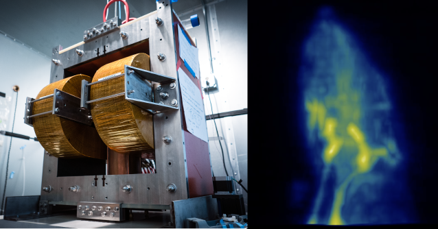

Goal of the talk: correct by construction matrices
--------------------------------------------------

<!--
These comment blocks let me hide stuff! :-D I have to put this top one under
a slide header to prevent an empty slide.

```agda
open import Relation.Binary.PropositionalEquality hiding ([_])
open ≡-Reasoning

open import Data.Nat using (ℕ; zero; suc) renaming (_+_ to _+ᴺ_)
open import Data.List hiding (replicate; sum; map)
open import Data.Vec using (Vec; replicate; map) renaming ([] to []ⱽ; _∷_ to _∷ⱽ_)
open import Data.Bool using (Bool)

open import Function using (id)

open import FLA.Algebra.Structures
open import FLA.Algebra.LinearAlgebra
open import FLA.Algebra.LinearAlgebra.Properties
open import FLA.Algebra.LinearMap
open import FLA.Algebra.LinearAlgebra.Matrix hiding (_*ᴹ_; _ᵀ)
open import FLA.Algebra.LinearAlgebra.Properties.Matrix
open import FLA.Data.Vec.Properties

module FormalizingLinearAlgebraAlgorithms where

variable
  A B C : Set
  m n p q : ℕ

-- Construct lists using a more convenient syntax
pattern [_,_] y z = y ∷ z ∷ []
pattern [_,_,_] x y z = x ∷ y ∷ z ∷ []

pattern [_,_]ⱽ y z = y ∷ⱽ z ∷ⱽ []ⱽ
pattern [_,_,_]ⱽ x y z = x ∷ⱽ y ∷ⱽ z ∷ⱽ []ⱽ
```
-->

We want to be able to enforce that a user cannot create an incorrect matrix,
or use a matrix improperly.

. . .

There are a few ways one can go wrong:

- Improper sizing

```haskell
      data Matrix a = Matrix [[a]]
      testMatrix = Matrix [[1, 2, 3], [3, 4]]
```

. . .

- Improper data types

```python
      np.array([1, "a"])
```

. . .

Plus a few more surprising errors to get to later!

. . .

For this talk, we will mostly be using Agda syntax ("Haskell-like").


First step: define a type for a matrix
--------------------------------------

A matrix can be seen as a table of numbers, which we could encode as

```agda
data MatrixOfNumbers (A : Set) : Set where
    ConstructMatrixOfNumbers : List (List A) → MatrixOfNumbers A
```

. . .

which is equivalent to the Haskell

```haskell
data MatrixOfNumbers a = ConstructMatrixOfNumbers [[a]]
```

and in Python

```python
A = TypeVar['A']

@dataclass
class MatrixOfNumbers(Generic[A])
    matrix : List[List[A]]
```


First step: define a type for a matrix
--------------------------------------

A matrix can be seen as a table of numbers, which we could encode as

~~~agda
data MatrixOfNumbers (A : Set) : Set where
    ConstructMatrixOfNumbers : List (List A) → MatrixOfNumbers A
~~~

To encode the matrix

\undovspacepause
\undovspacepause
$$
M_n = \begin{bmatrix} 1 & 2 & 3 \\ 4 & 5 & 6 \end{bmatrix}
$$

. . .

we would write

```agda
Mₙ : MatrixOfNumbers ℕ -- Natural numbers
Mₙ = ConstructMatrixOfNumbers [ [ 1 , 2 , 3 ] , [ 4 , 5 , 6 ] ]
```

. . .

Conventions used in this talk : `A` is a type, $M_{i}$ is a matrix, `m n p
q` are natural numbers, and `u v x y` are vectors.


What can we do with a matrix?
-----------------------------

A matrix can be used in a few different cases:

::: incremental

1. Multiply a matrix with a vector (matrix-vector multiply): $Mx$
2. Transform a matrix to get a new matrix (transpose): $M^Tx$
3. Combine matrices (matrix-matrix multiply): $M_1 * M_2$

:::


What is matrix-vector multiplication?
-------------------------------------

Matrix-vector multiply transforms one vector into another through
multiplication and addition.

$$
\begin{array}{c@{ }c@{ }c@{ }c@{ }c@{ }c@{ }c}
\begin{bmatrix}
1 & 2 & 3\\
4 & 5 & 6
\end{bmatrix} & * &
\begin{bmatrix}
1 \\ 2 \\ 3
\end{bmatrix} & = &
\begin{bmatrix}
(1 * 1) + (2 * 2) + (3 * 3) \\
(4 * 1) + (5 * 2) + (6 * 3)
\end{bmatrix} & = &
\begin{bmatrix} 14 \\ 32
\end{bmatrix}
\\
M & * & x & = & & & y
\end{array}
$$

. . .

Another way to think of matrix-vector multiplication is

$M$ is a _function_ from vectors of size 3 to vectors of size 2. This
function is sometimes called a _linear map_.


Example of a matrix as a function: identity
-------------------------------------------

The identity matrix converts a vector into the same vector.

$$
I * v = \begin{bmatrix}
  1 & \cdots & 0 \\
  \vdots & \ddots & \vdots \\
  0 & \cdots & 1
  \end{bmatrix} * v = v
$$

. . .

If we were to write out the identity matrix as a function, it would be the
same as the identity function.

```agda
list-identity : List A → List A
list-identity l = l
```


Example of a matrix as a function: diag
---------------------------------------

The diagonal matrix point-wise multiplies one vector with another (written as
$*^V$).

$$
diag(u) * v = \begin{bmatrix}
  u_1 & \cdots & 0 \\
  \vdots & \ddots & \vdots \\
  0 & \cdots & u_n
  \end{bmatrix} * v = u *^V v
$$

. . .

written as a function, this would look like

~~~agda
diag : List A → (List A → List A)
diag u = λ v → u *ⱽ v
~~~

or alternatively as

~~~agda
diag u = λ v → zipWith _ (_*_) u v
~~~


Let's define a matrix as a function!
------------------------------------

We can define a matrix as just a function then that takes a vector and
returns a new one.

```agda
data FunctionalMatrix (A : Set) : Set where
    ConstructFunctionalMatrix : (List A → List A) → FunctionalMatrix A
```

. . .

Now we can construct the identity matrix as follows:

```agda
Mᵢ : FunctionalMatrix A
Mᵢ = ConstructFunctionalMatrix (list-identity)
```

. . .

This addresses the matrix-vector ability of a matrix, what else can we
tackle functionally?


We have matrix-vector multiply down, can we do more?
----------------------------------------------------

With our functional definition of a matrix, we can do other operations like
matrix-matrix multiply.

\undovspacepause
\undovspacepause
$$
(M_1 * M_2) v = M_1(M_2(v))
$$

. . .

```agda
_·ᶠ_ : FunctionalMatrix A → List A → List A
ConstructFunctionalMatrix f ·ᶠ l = f l
```

<!--
```agda
infixr 10 _·ᶠ_
```
-->


. . .

\vspace{-0.5em}
```agda
apply_two_matrices : FunctionalMatrix A → FunctionalMatrix A
                   → List A → List A
apply_two_matrices M₁ M₂ v = M₁ ·ᶠ M₂ ·ᶠ v
```

. . .

Hmm that looks a lot like composition:

```agda
_∘ᶠ_ : FunctionalMatrix A → FunctionalMatrix A → FunctionalMatrix A
M₁ ∘ᶠ M₂ = ConstructFunctionalMatrix (apply_two_matrices M₁ M₂)
```


We often need the transpose matrix at the same time
---------------------------------------------------

This type encapsulates the function nature of a matrix, but we often
need the transpose as well.

```agda
data FunctionalMatrixWithTranpose (A : Set) : Set where
    ConstructFMT : (List A → List A) -- Forward function
                 → (List A → List A) -- Transpose function
                 → FunctionalMatrixWithTranpose A
```

. . .

We can now define the identity matrix with the transpose matrix function,
which is also the identity.

```agda
Mᵢ,ₜ : FunctionalMatrixWithTranpose A
Mᵢ,ₜ = ConstructFMT (list-identity) (list-identity)
```


What are the benefits of this approach?
---------------------------------------

We gain a few benefits from using functions directly.

::: incremental

- Write out the model for a process in a more direct manner.
- Speed and time benefits.
  

:::


Magnetic Particle Imaging reconstructs images using functional matrices
-----------------------------------------------------------------------

A model of how the device (left) generates signals from the sample (rat,
right) is encoded as "matrix-free" functions in Python using PyOp, the
python implementation of this idea.




Matrix-free methods enable significant time and space savings
-------------------------------------------------------------

We get a sizeable improvement in image reconstruction performance using a
matrix-free method.

<!--
```python
@dataclass
class Matrix:
    forward  : Callable[[numpy.ndarray], numpy.ndarray]
    tranpose : Callable[[numpy.ndarray], numpy.ndarray]

# And associated operators for matrix multiply, addition, etc.
```
-->

. . .

                     Metric  Matrix  Matrix-Free  Improvement
---------------------------  ------  -----------  -----------
Space                        150 GB     bytes       $10^9x$
Time                         60 min     2 min        $30x$
Use of functional concepts     No        Yes       Priceless


Intuition check : convert a functional matrix into a number matrix
------------------------------------------------------------------

For the rest of the rules of linear algebra to apply, we should always be
able to define an equivalent functions using only multiplication and
addition.

For example our original identity function

~~~agda
identity' : List A → List A
identity' v = v
~~~

. . .

could be written as

~~~agda
identity' : List A → List A
identity' v = replicate (len v) 1 *ⱽ v
~~~

where `replicate` creates a list of 1s and `*ⱽ` multiplies each element in
two vectors together.


Is `FunctionalMatrixWithTranspose` "correct by construction"?
-------------------------------------------------------------

<!--
```agda
postulate
  randomlySizedNewList : List ℕ → List ℕ
```
-->

Our original goal was

> Correct by construction linear algebra

Is this true for `FunctionalMatrixWithTranspose`?

. . .

```agda
f₁ : List ℕ → List ℕ
f₁ v = randomlySizedNewList v

Mᵣ : FunctionalMatrixWithTranpose ℕ
Mᵣ = ConstructFMT f₁ f₁
```

. . .

Hmm, intuition check: can we write `Mᵣ` as a matrix of numbers?

. . .

\undovspacepause
$$
m_r = \begin{bmatrix} \vcdice{1} & \vcdice{2} \\ \vcdice{3} & \vcdice{4} \end{bmatrix}
$$

If we could convert a random number generator to a number, sure! `:-(`


Encoding the length of the vector in the type
---------------------------------------------

Agda allows us to specify what the length of a vector as part of the type.[^1]

```agda
v : Vec ℕ 3
v = [ 1 , 2 , 3 ]ⱽ
```

. . .

If we try to create a vector of the wrong length, Agda will tell us.

~~~agda
v₂ : Vec ℕ 2
v₂ = v
-- Get the following error: 3 != 2 of type ℕ
~~~

. . .

`Vec` is a _dependent type_ because its type _depends on a value_.

[^1]: This is a bit of a misnomer; the difference between term and type is
muddled in most dependently typed languages.


Use functions on Vec to ensure that the shapes match
----------------------------------------------------

We can define a matrix type where the shapes are preserved.

```agda
data SizedMatrix (A : Set) (m n : ℕ) : Set where
    ConstructSizedMatrix :  (Vec A n → Vec A m) -- Forward function
                         → (Vec A m → Vec A n) -- Transpose function
                         → SizedMatrix A m n
```

Previously this would be done with a runtime check.

. . .

In Haskell, we would write this as

```haskell
data SizedMatrix (A :: *) (m :: Nat) (n :: Nat) where
    ConstructSizedMatrix :: (KnownNat m, KnownNat n)
                         => (Vec A n → Vec A m) -- Forward function
                         -> (Vec A m → Vec A n) -- Transpose function
                         -> SizedMatrix A m n
```


Use functions on Vec to ensure that the shapes match
----------------------------------------------------

We can define a matrix type where the shapes are preserved.

~~~agda
data SizedMatrix (A : Set) (m n : ℕ) : Set where
    ConstructSizedMatrix : (Vec A n → Vec A m) -- Forward function
                         → (Vec A m → Vec A n) -- Transpose function
                         → SizedMatrix A m n
~~~

. . .

We can now define our identity matrix again.

~~~agda
id : (A : Set) → A → A
~~~

```agda
Mᵢ,ₛ : SizedMatrix A n n
Mᵢ,ₛ = ConstructSizedMatrix id id -- id : Vec A n → Vec A n
```


Intuition check: can we encode matrices that are not possible to write out?
---------------------------------------------------------------------------

Our original goal was

> Correct by construction linear algebra

. . .

We could write a matrix for handling playing cards.

```agda
data Card : Set where
  ♠ ♣ ♥ ♢ : Card
```
. . .

```agda
M♠ : SizedMatrix Card n n
M♠ = ConstructSizedMatrix (λ v → replicate ♠) (λ v → replicate ♥)
```

. . .

If we wanted to convert this to multiplication and addition only....

\undovspacepause
\undovspacepause
$$
M♠ = \begin{bmatrix}
\clubsuit & \heartsuit \\
\spadesuit & \diamondsuit
\end{bmatrix}
$$

Matrices cannot contain just anything! The elements have to be able to be
added/multiplied.


Matrices are defined over fields
--------------------------------

To check our intuition we have been trying to determine if our function
could be written using multiplication and addition. Formally, this is
equivalent to saying the elements of a matrix are from a _Field_.

. . .

~~~agda
record Field (A : Set) : Set where
  field
    _+_ : A → A → A -- 3 + 4
    _*_ : A → A → A -- 3 * 4
~~~

. . .

~~~agda
    -_  : A → A -- + inverse, - 4
    _⁻¹ : A → A -- * inverse, 4 ⁻¹
~~~

. . .

~~~agda
    0ᶠ  : A -- Identity of _+_, 4 + 0ᶠ = 4
    1ᶠ  : A -- Identity of _*_, 4 * 1ᶠ = 4
~~~


We can define matrices that operate on Fields only
--------------------------------------------------

Now we can restrict our `A` type to having a defined version of `+` and `*`.

```agda
data SizedFieldMatrix (A : Set) ⦃ F : Field A ⦄ (m n : ℕ) : Set where
    ConstructSizedFieldMatrix :  (Vec A n → Vec A m) -- Forward function
                              → (Vec A m → Vec A n) -- Transpose function
                              → SizedFieldMatrix A m n
```

. . .

in Haskell this would be written as

```haskell
data SizedFieldMatrix A (m :: Nat) (n :: Nat) where
    ConstructSizedFieldMatrix :: (KnownNat m, KnownNat n, Field A)
                              => (Vec A n → Vec A m) -- Forward function
                              -> (Vec A m → Vec A n) -- Transpose function
                              -> SizedFieldMatrix A m n
```


We can define matrices that operate on Fields only
--------------------------------------------------

Now we can restrict our `A` type to having a defined version of `+` and `*`.

~~~agda
data SizedFieldMatrix (A : Set) ⦃ F : Field A ⦄ (m n : ℕ) : Set where
    ConstructSizedFieldMatrix :  (Vec A n → Vec A m) -- Forward function
                              → (Vec A m → Vec A n) -- Transpose function
                              → SizedFieldMatrix A m n
~~~

The card example can no longer be constructed, but the identity matrix still
can be constructed.

```agda
-- + and * must be defined on A
Mₛᶠᵢ : ⦃ F : Field A ⦄ → SizedFieldMatrix A n n
Mₛᶠᵢ = ConstructSizedFieldMatrix id id
```
. . .

Are we missing anything else to be "correct by construction"?


Matrices are linear functions
-----------------------------

Matrices have the following properties that we'd like to preserve:

- Linearity: $M(u +^V v) = M(u) +^V M(v)$

. . .

- Homogeneity : $M(c \circ^V v) = c \circ^V M(v)$

. . .

Currently we could define a matrix like so, which has neither property.

```agda
_ : ⦃ F : Field A ⦄ → SizedFieldMatrix A n n
_ = ConstructSizedFieldMatrix (λ v → replicate 1ᶠ) (λ v → replicate 1ᶠ)
```

<!--
```agda
  where
    open Field {{...}}
```
-->

. . .

- Linearity : $f(u +^V v) = 1 \ \ \neq \ \ f(u) +^V f(v) = 1 +^V 1 = 2$

. . .

- Homogeneity : $f(c \circ^V v) = 1 \ \ \neq \ \ c \circ^V f(v) = c \circ^V 1 = c$


How do we ensure that our functions are linear?
-----------------------------------------------

For our matrices to make sense, we need the functions that are used for the
forward and transpose functions to be linear functions.

~~~agda
-- A linear function (aka a linear map)
record _⊸_ {A : Set} ⦃ F : Field A ⦄ (m n : ℕ) : Set where
  field
    f : (Vec A m → Vec A n)
~~~

. . .

\undovspacepause
~~~agda
    f[u+v]≡f[u]+f[v] : (u v : Vec A m) → f (u +ⱽ v) ≡ f u +ⱽ f v
~~~

. . .

\undovspacepause
~~~agda
    f[c*v]≡c*f[v] : (c : A) → (v : Vec A m) → f (c ∘ⱽ v) ≡ c ∘ⱽ (f v)
~~~

. . .

with this we could define our matrices using linear functions.

```agda
data LinearMatrix {A : Set} ⦃ F : Field A ⦄ (m n : ℕ) : Set where
  ConstructLinearMatrix : (n ⊸ m) → (m ⊸ n) → LinearMatrix m n
```


What is this `≡` thing?
-----------------------

The `≡` sign means that two things are equal[^2] in the sense that the left
and the right side can be written with the same order of constructors[^3].

. . .

The definition of `≡` is

~~~agda
data _≡_ (x : A) : A → Set where
  refl : x ≡ x
~~~

. . .

we can note two things

- The only way to construct an instance of `≡` is the `refl` constructor
- The `refl` constructor can only be constructed from two pieces that are
  the same `A`.

[^2]: Homogenously
[^3]: Their normal forms are equivalent


Demonstrating equality on natural numbers
-----------------------------------------

For example, if we have the data type for natural numbers

~~~agda
data ℕ where
  zero : ℕ      -- 0
  suc  : ℕ → ℕ -- 1 + n
~~~

. . .

we can demonstrate that two numbers are equivalent by making sure they are
the same series of `suc` and `zero`.

```agda
two = suc (suc zero)

a = suc (suc (suc zero)) -- 3
b = suc (two)            -- 3 as well
```

. . .

```agda
_ : a ≡ b
_ = refl -- suc (suc (suc zero)) ≡ suc (suc (suc zero))
```


Fields must follow some properties on top of defining `+` and `*`
-----------------------------------------------------------------

Fields define more than just `+` and `*`; a field must also adhere to some
properties.

~~~agda
+-assoc   : (a b c : A) → a + (b + c) ≡ (a + b) + c
+-comm    : (a b : A)   → a + b ≡ b + a
+-0       : (a : A)     → a + 0ᶠ ≡ a
+-inv     : (a : A)     → (- a) + a ≡ 0ᶠ
~~~

. . .

~~~agda
*-assoc   : (a b c : A) → a * (b * c) ≡ (a * b) * c
*-comm    : (a b : A)   → a * b ≡ b * a
*-1       : (a : A)     → a * 1ᶠ ≡ a
*-inv     : (a : A)     → (a ≢ 0ᶠ) → (a ⁻¹) * a ≡ 1ᶠ
~~~

. . .

~~~agda
*-distr-+ : (a b c : A) → a * (b + c) ≡ (a * b) + (a * c)
~~~


Proofs can be used to rewrite terms
-----------------------------------

Let's use the `Field` proofs we have to construct a new proof.

<!--
```agda
module _ ⦃ F : Field A ⦄ where
  open Field F
```
-->

```agda
  new_proof : (b : A) → (b + 0ᶠ) * 1ᶠ ≡ b
  new_proof b = begin
    (b + 0ᶠ) * 1ᶠ
```

. . .

\undovspacepause
```agda
    ≡⟨ *-1 (b + 0ᶠ) ⟩ -- *-1 : (a : A) → a * 1ᶠ ≡ a
```

. . .

\undovspacepause
```agda
    b + 0ᶠ
```

. . .

\undovspacepause
```agda
    ≡⟨ +-0 b ⟩ -- +-1 : (a : A) → a + 0ᶠ ≡ a
```

. . .

\undovspacepause
```agda
    b ∎
```

Proving that the identity function is linear
--------------------------------------------

The linear identity function is simple

```agda
idₗ : ⦃ F : Field A ⦄ → n ⊸ n
idₗ = record
  { f = id -- Vec A n → Vec A n
```

. . .

\undovspacepause
```agda
  ; f[u+v]≡f[u]+f[v] = λ u v → refl -- id (u +ⱽ v) ≡ id u +ⱽ id v
```

. . .

\undovspacepause
```agda
  ; f[c*v]≡c*f[v] = λ c v → refl -- id (c ∘ⱽ v) ≡ c ∘ⱽ id v
  }
```


Proving that the `diag` function is linear
------------------------------------------

Now let's try to define the `diag` function as a linear function

```agda
diagₗ : ⦃ F : Field A ⦄ → Vec A n → n ⊸ n
diagₗ d = record
  { f = d *ⱽ_
```

. . .

```agda
  -- *ⱽ-distr-+ⱽ : d *ⱽ (u +ⱽ v) ≡ d *ⱽ u +ⱽ d *ⱽ v
  ; f[u+v]≡f[u]+f[v] = λ u v → *ⱽ-distr-+ⱽ d u v
```

. . .

```agda
  -- *ⱽ∘ⱽ≡∘ⱽ*ⱽ : d *ⱽ (c ∘ⱽ v) ≡ c ∘ⱽ (d *ⱽ v)
  ; f[c*v]≡c*f[v] = λ c v → *ⱽ∘ⱽ≡∘ⱽ*ⱽ c d v
  }
```

Let's go through the linearity proof for `diag`
-----------------------------------------------

To show how one proves linearity for `diag`, let's step through the proof.

<!--
```agda
module _ ⦃ F : Field A ⦄ where
  open Field F
```
-->

```agda
  *ⱽ-distr-+ⱽ' : (d u v : Vec A n)
              → d *ⱽ (u +ⱽ v) ≡ d *ⱽ u +ⱽ d *ⱽ v
```

. . .

```agda
  *ⱽ-distr-+ⱽ' []ⱽ []ⱽ []ⱽ = refl
```

. . .

```agda
  *ⱽ-distr-+ⱽ' (d₀ ∷ⱽ dᵣ) (u₀ ∷ⱽ uᵣ) (v₀ ∷ⱽ vᵣ) = begin
      (d₀ ∷ⱽ dᵣ) *ⱽ ((u₀ ∷ⱽ uᵣ) +ⱽ (v₀ ∷ⱽ vᵣ)) ≡⟨⟩
      (d₀ * (u₀ + v₀)) ∷ⱽ (dᵣ *ⱽ (uᵣ +ⱽ vᵣ))
```

. . .

```agda
    ≡⟨ cong ((d₀ * (u₀ + v₀)) ∷ⱽ_) (*ⱽ-distr-+ⱽ' dᵣ uᵣ vᵣ) ⟩
      (d₀ * (u₀ + v₀)) ∷ⱽ (dᵣ *ⱽ uᵣ +ⱽ dᵣ *ⱽ vᵣ)
```

. . .

```agda
    ≡⟨ cong (_∷ⱽ (dᵣ *ⱽ uᵣ +ⱽ dᵣ *ⱽ vᵣ)) (*-distr-+ d₀ u₀ v₀) ⟩
      (d₀ * u₀ + d₀ * v₀) ∷ⱽ (dᵣ *ⱽ uᵣ +ⱽ dᵣ *ⱽ vᵣ) ≡⟨⟩
      (d₀ ∷ⱽ dᵣ) *ⱽ (u₀ ∷ⱽ uᵣ) +ⱽ (d₀ ∷ⱽ dᵣ) *ⱽ (v₀ ∷ⱽ vᵣ) ∎
```

How we can finally define our LinearMatrix!
-------------------------------------------

We can finally define a linear function.

~~~agda
data LinearMatrix {A : Set} ⦃ F : Field A ⦄ (m n : ℕ) : Set where
  ConstructLinearMatrix : (n ⊸ m) → (m ⊸ n) → LinearMatrix m n
~~~

```agda
id-linear : ⦃ F : Field A ⦄ → LinearMatrix n n
id-linear = ConstructLinearMatrix idₗ idₗ
```

. . .

Have we reached "Correct by construction linear algebra"?


Does the transpose match?
-------------------------

Say we defined a matrix as so

```agda
Mₙₒ : ⦃ F : Field A ⦄ → LinearMatrix n n
Mₙₒ = ConstructLinearMatrix (idₗ) (diagₗ (replicate 1ᶠ))
```

<!--
```agda
  where
    open Field {{...}}
```
-->

. . .

We have mixed up the forward/transpose pairing between our two linear functions.

\undovspacepause
\undovspacepause
$$
\begin{aligned}
I & = I^T\\
diag(v) & = diag(v)^T
\end{aligned}
$$

. . .

To solve this problem, we can show that for forward function `M` and
transpose function `Mᵀ` that the following property holds.

\undovspacepause
\undovspacepause
$$
\begin{gathered}
\forall x y. \langle x , M y \rangle = \langle y , M^T x \rangle \\
\langle a , b \rangle = \textrm{sum}(a *^V b) = \sum_i^n a_i * b_i
\end{gathered}
$$


Finally we reach our goal!
--------------------------

If we require the user to prove the inner product property, we can _finally_
create a "correct by construction" functional matrix.

~~~agda
data Mat_×_ {A : Set} ⦃ F : Field A ⦄ (m n : ℕ) : Set where
  _,_,_ :  (M  : n ⊸ m )
          → (Mᵀ : m ⊸ n )
          → (p : (x : Vec A m) → (y : Vec A n)
                → ⟨ x , M ·ˡᵐ y ⟩ ≡ ⟨ y , Mᵀ ·ˡᵐ x ⟩ )
          → Mat m × n
~~~

where the inner product (`⟨⟩`) is defined as

~~~agda
⟨_,_⟩ : ⦃ F : Field A ⦄ → Vec A n → Vec A n → A
⟨ x , y ⟩ = sum (x *ⱽ y)
~~~


The final identity functional matrix
------------------------------------

With this, we can finally define the identity matrix in a way that is not
possible to make an error.

```agda
Mᴵ : ⦃ F : Field A ⦄ → Mat n × n
Mᴵ =  idₗ , idₗ , id-transpose  
  where
```
<!--
```agda
    open Field {{...}}
```
-->
```agda
    id-transpose : ⦃ F : Field A ⦄ (x y : Vec A n)
                  → ⟨ x , id y ⟩ ≡ ⟨ y , id x ⟩
```

. . .

```agda
    id-transpose x y = begin
      ⟨ x , id y ⟩ ≡⟨⟩
      ⟨ x , y ⟩    ≡⟨ ⟨⟩-comm x y ⟩
      ⟨ y , x ⟩    ≡⟨⟩
      ⟨ y , id x ⟩ ∎
```

What can we do with a matrix
----------------------------

We can do a few things with a matrix:

1. Multiply the matrix with a vector (matrix-vector multiply): $Mx$
2. Transform the matrix to get a new matrix (transpose): $M^Tx$
3. Combine matrices (matrix-matrix multiply): $M_1 * M_2$

. . .

We have not done matrix-matrix multiplication, can we implement it with our
new definition?

<!--
```agda
_-ⱽ_ : ⦃ F : Field A ⦄ → Vec A n → Vec A n → Vec A n
x -ⱽ y = x +ⱽ (map (-_) y)
  where
    open Field {{...}}

infixl 6 _-ⱽ_

iterate : ℕ → A → (A → A) → List A
iterate 0 x f = x ∷ []
iterate (suc n) x f = x ∷ iterate n (f x) f

_·_ = _·ᴹₗ_
_·ˡ_ = _·ˡᵐ_

infixr 20 _·_

postulate
  TrustMe! : A
```
-->


Implementing matrix-matrix multiply on functional matrices
----------------------------------------------------------

With our first iteration, we were able to define matrix-matrix multiplication

$$
M_1 * M_2
$$

using function composition

~~~agda
apply_two_matrices : FunctionalMatrix A → FunctionalMatrix A
                   → List A → List A
apply_two_matrices F G v = F ·ᶠ G ·ᶠ v

_∘ᶠ_ : FunctionalMatrix A → FunctionalMatrix A → FunctionalMatrix A
F ∘ᶠ G = ConstructFunctionalMatrix (apply_two_matrices F G)
~~~

. . .

We can do the same with our new definition, by performing composition of the
linear functions.


Matrix-matrix multiply toolbox
------------------------------

We are going to need a few functions to get there. One to extract the
linear functions.

```agda
Mat-to-⊸ : ⦃ F : Field A ⦄ → Mat m × n → n ⊸ m
Mat-to-⊸  f , t , p  = f

_ᵀ : ⦃ F : Field A ⦄ → Mat m × n → Mat n × m
 f , a , p  ᵀ =  a , f , (λ x y → sym (p y x)) 
```
<!--
```agda
infixl 25 _ᵀ
```
-->

. . .

and a way to compose linear functions

```agda
_∘ˡ_ : ⦃ F : Field A ⦄ → n ⊸ p → m ⊸ n → m ⊸ p
g ∘ˡ h = record {
    f = λ v → g ·ˡ (h ·ˡ v)
```

. . .

\undovspacepause
```agda
  ; f[u+v]≡f[u]+f[v] = TrustMe!
  ; f[c*v]≡c*f[v] = TrustMe! }
```


Defining matrix-matrix multiply
-------------------------------

We can now define matrix-matrix multiply. If we remember that we need to

$$
\begin{aligned}
\textrm{forward : } & M_1 * M_2 \\
\textrm{transpose : } & (M_1 * M_2)^T = M_2^T * M_1^T
\end{aligned}
$$

. . .

Which we can directly encode in Agda.

```agda
_*ᴹ_ : ⦃ F : Field A ⦄ → Mat m × n → Mat n × p → Mat m × p
M₁ *ᴹ M₂ =
   (Mat-to-⊸ M₁) ∘ˡ (Mat-to-⊸ M₂)
  , (Mat-to-⊸ (M₂ ᵀ)) ∘ˡ (Mat-to-⊸ (M₁ ᵀ))
```

. . .

```agda
  , TrustMe!
  
```

What do we have so far with this encoding?
------------------------------------------

We have gained some nice benefits by moving to a proven type constructor.

::: incremental

- We can define a performant, functional version of matrix algebra.
- We can guarantee that our implementation is correct.
- We can use equational reasoning to prove two implementations are equivalent.

:::

. . .

But there is a cost. For one file in the library that implements this idea,
out of 213 lines of code:

. . .

24 lines are function definitions (11.3% of the code). _Everything else is
either a proof, a type signature, or an import/control statement_


Algorithms using Linear Algebra
===============================


Magnetic Particle Imaging can be modeled using linear algebra
-------------------------------------------------------------

In MPI, we are attempting to detect where iron is within a sample.

\undovspacepause
- $v$\ : the voltages coming off of the device.
- $f_e$\ : the distribution of iron.
- $M$\ : a _function_ that converts iron distributions into voltages.


Solving linear equations finds what input produces an observed result
---------------------------------------------------------------------

We can write this process of converting iron distributions to voltages as

$$
M f_e = v
$$

If we have the voltages $v$ coming off the device, we want to find the iron
distribution $f_e$ that produced that signal.

. . .

To solve this problem, we want to compare how good our estimate of the input
$x$ is at producing the observed output $y$ using the following function.

$$
J(f_e) = f_e^T M^T M f_e - 2 f_e M^T v
$$


Taking a `step` in the right direction
--------------------------------------

One simple way to find a better $x$ than some initial guess is to update $x$
_in the direction of steepest descent $\nabla J$_.

$$
\begin{aligned}
f_{e,i+1} & = f_{e,i} - \alpha \nabla J (f_{e,i}) \\
f_{e,i+1} & = f_{e,i} - \alpha (M^T (M f_{e,i} - v))
\end{aligned}
$$

. . .

We can implement this in Agda as

```agda
step :  ⦃ F : Field A ⦄
     → (α : A) → (M : Mat m × n)
     → (v : Vec A m) → (fₑ : Vec A n) → Vec A n
step α M v = λ fₑ → fₑ -ⱽ α ∘ⱽ (M ᵀ · (M · fₑ -ⱽ v))
```
<!--
```agda
  where
    open Field {{...}}
```
-->

Gradient descent is just running `step` a bunch of times
--------------------------------------------------------

From there, we can find the value of $x$ that best matches $y$ by iterating.

```agda
gradient-descent :  ⦃ F : Field A ⦄
                 → (n : ℕ)         -- Number of iterations to run
                 → (α : A)         -- Scale factor
                 → (M : Mat m × n) -- Model of system
                 → (v : Vec A m)   -- Data
                 → (fₑ : Vec A n)  -- Initial estimate
                 → List (Vec A n)  -- Results (farther is better)
gradient-descent n α M v fₑ = iterate n fₑ (step α M v)

-- iterate _ x f = [x, f x, f (f x), ... ]
```

<!--
```agda
postulate
  M-distr--ⱽ : ⦃ F : Field A ⦄ → (M : Mat m × n) → (u v : Vec A n) → M · (u -ⱽ v) ≡ M · u -ⱽ M · v
```
-->


We cna define equivalent forms of a linear equation
---------------------------------------------------

We had defined our step function as

~~~agda
step α M v fₑ = fₑ -ⱽ α ∘ⱽ (M ᵀ · (M · fₑ -ⱽ v))
~~~

is there another way to write this function?

. . .

yes!

```agda
step' :  ⦃ F : Field A ⦄
      → (α : A) → (M : Mat m × n)
      → (v : Vec A m) → (fₑ : Vec A n) → Vec A n
step' α M v fₑ = fₑ -ⱽ α ∘ⱽ (M ᵀ · M · fₑ -ⱽ M ᵀ · v)
```


Proving the two `step`s are in lock step
---------------------------------------

We can prove that `step` and `step'` are the same by saying that when we
apply the same inputs to `step` and `step'`, we get the same result.[^4]

```agda
proof :  ⦃ F : Field A ⦄ → (α : A)
      → (M : Mat m × n) → (v : Vec A m) → (fₑ : Vec A n)
      → step α M v fₑ ≡ step' α M v fₑ
proof α M v fₑ = begin
  fₑ -ⱽ α ∘ⱽ (M ᵀ · (M · fₑ -ⱽ v))
```

. . .

```agda
  -- M-distr--ⱽ : M (fₑ -ⱽ v) ≡ M fₑ -ⱽ M v
  ≡⟨ cong (λ z → fₑ -ⱽ α ∘ⱽ z) (M-distr--ⱽ (M ᵀ) (M · fₑ) v) ⟩
  fₑ -ⱽ α ∘ⱽ (M ᵀ · M · fₑ -ⱽ M ᵀ · v) ∎
```

[^4]: Proving that `step` and `step'` are the same is an extensional
statement, and requires function extensionality.


Have we accomplished our goal?
------------------------------

Our original goal was

> Correct by construction linear algebra

. . .

we certainly achieved that!

. . .

::: incremental

- Eliminated wrong size result bugs.
- Eliminated non-linear function bugs.
- Eliminated incorrect function pairing bugs.

:::


Comparing the steps we went through
-----------------------------------

Through this process, we went through three different implementations of
matrices as functions.

::: incremental

- Regular functions (Python: `PyOp` library)
- Size-typed functions (Haskell: `convex` library)
- Linear functions (Agda: `FLA` library)

:::


API comparison: how likely am I to use this?
--------------------------------------------

Not every library is a blast to use. How do these three functional
approaches stack up?


API comparison: how likely am I to use this?
--------------------------------------------

Not every library is a blast to use. How do these three functional
approaches stack up?


API comparison: how likely am I to use this?
--------------------------------------------

Not every library is a blast to use. How do these three functional
approaches stack up?


API comparison: how likely am I to use this?
--------------------------------------------

Not every library is a blast to use. How do these three functional
approaches stack up?


This presentation is a program!
-------------------------------

This presentation is an Agda program! Instructions for how to load the
presentation in Agda can be found at

[github.com/ryanorendorff/lc-2020-linear-algebra-agda](https://github.com/ryanorendorff/lc-2020-linear-algebra-agda)

The full library that implements this style (without `TrustMe!`) can be
found at

[github.com/ryanorendorff/functional-linear-algebra](https://github.com/ryanorendorff/functional-linear-algebra)


Questions?
----------

Thanks for listening to my talk!

[github.com/ryanorendorff/lc-2020-linear-algebra-agda](https://github.com/ryanorendorff/lc-2020-linear-algebra-agda)

{width=50%}


Appendix
========


Instructions for how to run this presentation in Agda
-----------------------------------------------------

If you have the [Nix][nix] package manager installed, you can run

~~~
nix-shell
~~~

at the root of this presentation's repo and then launch emacs

~~~
emacs src/FunctionalPresentation.lagda.md
~~~

More information on the Agda emacs mode can be found
[https://agda.readthedocs.io/en/v2.6.1.1/tools/emacs-mode.html][agda-emacs-mode]. If you use [Spacemacs][spacemacs], the
documentation for its Agda mode is [https://www.spacemacs.org/layers/+lang/agda/README.html][spacemacs-agda-mode].


<!-- References -->

[FLA]: https://github.com/ryanorendorff/functional-linear-algebra
[nix]: https://nixos.org
[agda-emacs-mode]: https://agda.readthedocs.io/en/v2.6.1.1/tools/emacs-mode.html
[spacemacs]: https://www.spacemacs.org/
[spacemacs-agda-mode]: https://www.spacemacs.org/layers/+lang/agda/README.html

<!--

TODOS:
------

- Should we show something that cannot be done in Haskell?
- Should we show a comparison to Agda for something like a list of Vectors?
  - It is not possible in Haskell due to https://gist.github.com/ryanorendorff/d05c378b71829e3c0c33de462cb9a973#gistcomment-3369425

    Because KnownNat constraints can only be constructed from other KnownNat
    constraints, because constraints are terms; they can't be constructed
    from types, because types are erased before run-time.

Vectors and Matrices in Agda: https://personal.cis.strath.ac.uk/james.wood.100/blog/html/VecMat.html


Unused slides

PyOp effectively stops here
---------------------------

The python implementation of this idea is effectively a class for
`FunctionalMatrixWithTranspose`.

```python
@dataclass
class Matrix:
    forward  : Callable[[numpy.ndarray], numpy.ndarray]
    tranpose : Callable[[numpy.ndarray], numpy.ndarray]
```

. . .

Pros/cons:

- Pro: It is very fast and easy to get started.
- Con: It is easy to screw up.
- Con: Uses runtime size checks on input/output vectors to make sure
  the matrices are mostly doing the right thing.
- Con: Larger matrices (especially those made up of other matrices) are
  tricky to debug.

Can we do anything fun with this definition?
--------------------------------------------

Transpose for a combination

$$
(A *^M B)^T = B^T *^M A^T
$$


Prove that the functions themselves, without the proofs, work
-------------------------------------------------------------

Prove through UIP
-----------------

How hard is the API
-------------------

::: incremental

- 213 lines of code
- 24 of those lines defined the functions themselves (11.3%)
- everything else is a proof, a type, or a control (import, etc) statement.

:::

-->

<!--  LocalWords:  Hmm min infty bmatrix vcdice Vec clubsuit heartsuit circ
 -->
<!--  LocalWords:  spadesuit diamondsuit neq Mx Tx cdots vdots ddots diag
 -->
<!--  LocalWords:  LinearMatrix forall langle rangle textrm nabla
 -->
