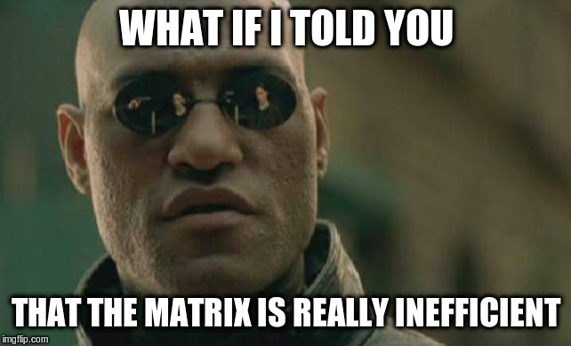

Goal: Correct by construction linear algebra
--------------------------------------------

<!--
These comment blocks let me hide stuff! :-D I have to put this top one under
a slide header to prevent an empty slide.


```agda
open import Relation.Binary.PropositionalEquality hiding ([_])
open ≡-Reasoning

open import Data.Nat using (ℕ; zero; suc) renaming (_+_ to _+ᴺ_)
open import Data.List hiding (replicate; sum)
open import Data.Vec using (Vec; replicate) renaming ([] to []ⱽ; _∷_ to _∷ⱽ_)
open import Data.Bool using (Bool)

open import Function using (id)

open import FLA.Algebra.Structures
open import FLA.Algebra.LinearAlgebra
open import FLA.Algebra.LinearAlgebra.Properties
open import FLA.Algebra.LinearMap
open import FLA.Algebra.LinearAlgebra.Matrix
open import FLA.Data.Vec.Properties

module FunctionalPresentation where

variable
  A B C : Set
  m n p q : ℕ

-- Construct lists using a more convenient syntax
pattern [_,_] y z = y ∷ z ∷ []
pattern [_,_,_] x y z = x ∷ y ∷ z ∷ []

pattern [_,_]ⱽ y z = y ∷ⱽ z ∷ⱽ []ⱽ
pattern [_,_,_]ⱽ x y z = x ∷ⱽ y ∷ⱽ z ∷ⱽ []ⱽ
```

-->

We want to be able to enforce that a user cannot create an incorrect matrix,
or use a matrix improperly.

. . .

There are a few ways one can go wrong:

- Improper sizing

```haskell
      data Matrix a = Matrix [[a]]
      testMatrix = Matrix [[1, 2, 3], [3, 4]]
```

. . .

- Improper data types

```python
      np.array([1, "a"])
```

. . .

Plus a few more ways to make an error.

. . .

For this talk, we will mostly be using Agda syntax ("Haskell-like").


First step: define a type for a matrix
--------------------------------------

A matrix can be seen as a table of numbers, which we could encode as follows

```agda
data MatrixOfNumbers (A : Set) : Set where
    ConstructMatrixOfNumbers : List (List A) → MatrixOfNumbers A
```

. . .

which is equivalent to the Haskell

```haskell
data MatrixOfNumbers a = ConstructMatrixOfNumbers [[a]]
```

and the Python

```python
A = TypeVar['A']

@dataclass
class MatrixOfNumbers(Generic[A])
    matrix : List[List[A]]
```


First step: define a type for a matrix
--------------------------------------

A matrix can be seen as a table of numbers, which we could encode as follows

~~~agda
data MatrixOfNumbers (A : Set) : Set where
    ConstructMatrixOfNumbers : List (List A) → MatrixOfNumbers A
~~~

To encode the matrix

$$
M_n = \begin{bmatrix} 1 & 2 & 3 \\ 4 & 5 & 6 \end{bmatrix}
$$

. . .

we would write

```agda

Mₙ : MatrixOfNumbers ℕ -- Natural numbers
Mₙ = ConstructMatrixOfNumbers [ [ 1 , 2 , 3 ] , [ 4 , 5 , 6 ] ]
```


What can we do with a matrix
----------------------------

We can do a few things with a matrix:

::: incremental

1. Multiply the matrix with a vector (matrix-vector multiply): $Mx$
2. Transform the matrix to get a new matrix (tranpose): $M^Tx$
3. Combine the matrix with other matrices (matrix-matrix multiply): $M_1 * M_2$

:::


What is matrix-vector multiplication?
-------------------------------------

The matrix-vector multiply transforms one vector into another through
multiplcation and addition.

$$
\begin{array}{c@{ }c@{ }c@{ }c@{ }c@{ }c@{ }c}
\begin{bmatrix}
1 & 2 & 3\\
4 & 5 & 6
\end{bmatrix} & * & \begin{bmatrix} 1 \\ 2 \\ 3 \end{bmatrix} & = & \begin{bmatrix} (1 * 1) + (2 * 2) + (3 * 3) \\ (4 * 1) + (5 * 2) + (6 * 3)  \end{bmatrix} & = & \begin{bmatrix} 14 \\ 32  \end{bmatrix}  \\
M & * & x & = & & & y
\end{array}
$$

. . .

Another way to think of matrix-vector multiplication is

$M$ is a _function_ from vectors of size 3 to vectors of size 2. This
function is sometimes called a _linear map_.


Example of a matrix as a function: identity
-------------------------------------------

The identity matrix converts a vector into the same vector.

$$
I * v = \begin{bmatrix}
  1 & \cdots & 0 \\
  \vdots & \ddots & \vdots \\
  0 & \cdots & 1
  \end{bmatrix} * v = v
$$

. . .

If we were to write out the identity matrix as a function, it would be the
same as the identity function.

```agda
list-identity : List A → List A
list-identity l = l
```


Example of a matrix as a function: diagonal
-------------------------------------------

The diagonal matrix pointwise multiplies one vector with another (written as
$*^V$).

$$
diag(u) * v = \begin{bmatrix}
  u_1 & \cdots & 0 \\
  \vdots & \ddots & \vdots \\
  0 & \cdots & u_n
  \end{bmatrix} * v = u *^V v
$$

. . .

written as a function, this would look like

~~~agda
diagonal : List A → (List A → List A)
diagonal u = λ v → u *ⱽ v
~~~

or alternatively as

~~~agda
diagonal u = λ v → zipWith _ (_*_) u v
~~~


Let's define a matrix as a function then!
-----------------------------------------

We can define a matrix as just a function then that takes a vector and
returns a new one.

```agda
data FunctionalMatrix (A : Set) : Set where
    ConstructFunctionalMatrix : (List A → List A) → FunctionalMatrix A
```

. . .

We will also define this helper function to apply a `FunctionalMatrix`
directly to an argument.

```agda
_·ᶠ_ : FunctionalMatrix A → List A → List A
ConstructFunctionalMatrix f ·ᶠ l = f l
```

<!--
```agda
infixr 10 _·ᶠ_
```
-->

. . .

Now we can construct the identity matrix as follows:

```agda
Mᵢ : (A : Set) → FunctionalMatrix A
Mᵢ A = ConstructFunctionalMatrix (list-identity)
```


We have matrix-vector multiply down, can we do more?
----------------------------------------------------

With our functional definition of a matrix, we can do other operations like
matrix-matrix multiply.


```agda
apply_two_matrices : FunctionalMatrix A → FunctionalMatrix A
                   → List A → List A
apply_two_matrices F G v = F ·ᶠ G ·ᶠ v
```

. . .

Hmm that looks a lot like composition:

```agda
_∘ᶠ_ : FunctionalMatrix A → FunctionalMatrix A → FunctionalMatrix A
F ∘ᶠ G = ConstructFunctionalMatrix (apply_two_matrices F G)
```


We often need the transpose matrix at the same time
---------------------------------------------------

This type encapsulates the function nature of a matrix, but we often
need the transpose as well.

```agda
data FunctionalMatrixWithTranpose (A : Set) : Set where
    ConstructFMT : (List A → List A) -- Forward function
                 → (List A → List A) -- Transpose function
                 → FunctionalMatrixWithTranpose A
```

. . .

We can now define the identity matrix with the transpose matrix function,
which is also the identity.

```agda
Mᵢ,ₜ : (A : Set) → FunctionalMatrixWithTranpose A
Mᵢ,ₜ A = ConstructFMT (list-identity) (list-identity)
```


What are the benefits of this approach?
---------------------------------------

We gain a few benefits from using functions directly.

::: incremental

- Write out the model for a process in a more direct manner.
- Speed and time benefits.
  

:::

Example: Magnetic Particle Imaging (MPI) converts data to images using this technique
-------------------------------------------------------------------------------------

A model of how the device (left) generates signals from the sample (rat,
right) is encoded as "matrix-free" functions in Python using PyOp.


Matrix-free methods enable significant time and space savings
-------------------------------------------------------------

We get a sizeable improvement in image reconstruction performance using a
matrix-free method.

                     Metric  Matrix  Matrix-Free  Improvement
---------------------------  ------  -----------  -----------
Space                        150 GB     bytes       $10^9x$
Time                         60 min     2 min        $30x$
Use of functional concepts     No        Yes       $\infty x$


Intuition check : convert a functional matrix into a number matrix
------------------------------------------------------------------

For the rest of the rules of linear algebra to apply, we should always be
able to define an equivalent functions using only multiplication and
addition.

For example our original identity function

    identity' : List A → List A
    identity' v = v

. . .

Could be written as

    identity' : List A → List A
    identity' v = replicate (len v) 1 *ⱽ v

where `replicate` creates a list of 1s and `*ⱽ` multiplies each element in
two vectors together.


Hmm, we made a boo-boo
----------------------

<!--
```agda
postulate
  randomlySizedNewList : List ℕ → List ℕ
```
-->

Our current formulation allows us to encode the following matrix.

```agda

f₁ : List ℕ → List ℕ
f₁ v = randomlySizedNewList v

Mᵣ : FunctionalMatrixWithTranpose ℕ
Mᵣ = ConstructFMT f₁ f₁
```

. . .

Hmm, intuition check: can we write `Mᵣ` as a matrix of numbers?

. . .

$$
M_r = \begin{bmatrix} \vcdice{1} & \vcdice{2} \\ \vcdice{3} & \vcdice{4} \end{bmatrix}
$$

if we could convert a random number generator to a number, sure! :-(


PyOp effectively stops here
---------------------------

The python implementation of this idea is effectively a class for
`FunctionalMatrixWithTranspose`.

```python
@dataclass
class Matrix:
    forward  : Callable[[numpy.ndarray], numpy.ndarray]
    tranpose : Callable[[numpy.ndarray], numpy.ndarray]
```

. . .

- It is very fast to get started, but easy to screw up.
- Uses runtime size checks on input/output vectors to make sure
  the matrices are mostly doing the right thing.
- Larger matrices (especially those made up of other matrices) are tricky to debug.


Encoding the length of the vector in the type
---------------------------------------------

Agda allows us to specify what the length of a vector as part of the type.[^1]

```agda
v : Vec ℕ 3
v = [ 1 , 2 , 3 ]ⱽ
```

. . .

If we try to create a vector of the wrong length, Agda will tell us.

    -- Does't work, get the following error
    -- 3 != 2 of type ℕ
    v₂ : Vec ℕ 2
    v₂ = v

. . .

`Vec` is a _dependent type_ because its type depends on a _value_ (in this
case 2 and 3).

[^1]: This is a bit of a misnomer; there is no difference between types and
terms in most dependently typed languages.


Let's encode this new definition in our matrix type
---------------------------------------------------

Sweet, so we can remove the runtime checks from the prior implementation in
the matrix type!

```agda
data SizedMatrix (A : Set) (m n : ℕ) : Set where
    ConstructSizedMatrix : (Vec A n → Vec A m) -- Forward function
                         → (Vec A m → Vec A n) -- Transpose function
                         → SizedMatrix A m n
```

. . .

We can now define our identity matrix again.

```agda
Mᵢ,ₛ : SizedMatrix A n n
Mᵢ,ₛ = ConstructSizedMatrix id id
```

. . .

This is where the dependent Haskell implementation (`convex`) stops.


Intuition check: can we encode matrices that are not possible to write out?
---------------------------------------------------------------------------

We could write a matrix for handling playing cards.

```agda
data Card : Set where
  ♠ ♣ ♥ ♢ : Card

M♠ : SizedMatrix Card n n
M♠ = ConstructSizedMatrix (λ v → replicate ♠) (λ v → replicate ♥)
```

. . .

If we wanted to convert this to multiplication and addition only, we have a
problem.

$$
M♠ = \begin{bmatrix} \clubsuit & \heartsuit \\ \spadesuit & \diamondsuit \end{bmatrix}
$$

Matrices cannot contain just anything! The elements have to be able to be
added/multiplied.


Matrices are defined over fields
--------------------------------

To check our intuition we have been trying to determine if our function
could be written using multiplication and addition. Formally, this is
equivalent to the matrices containing elements of a _Field_.

. . .

~~~agda
record Field (A : Set) : Set where
  field
    _+_ : A → A → A -- 3 + 4
    _*_ : A → A → A -- 3 * 4
~~~

. . .

~~~agda
    -_  : A → A -- + inverse, - 4
    _⁻¹ : A → A -- * inverse, 4 ⁻¹
~~~

. . .

~~~agda
    0ᶠ  : A -- Identity of _+_, 4 + 0ᶠ = 4
    1ᶠ  : A -- Identity of _*_, 4 * 1ᶠ = 4
~~~


Matrices that operate on fields only
------------------------------------

Now we can restrict our `A` type to having a defined version of `+` and `*`.

```agda
data SizedFieldMatrix (A : Set) ⦃ F : Field A ⦄ (m n : ℕ) : Set where
    ConstructSizedFieldMatrix : (Vec A n → Vec A m) -- Forward function
                              → (Vec A m → Vec A n) -- Transpose function
                              → SizedFieldMatrix A m n
```

The card example can no longer be constructed, but the identity matrix still can.

```agda
-- + and * must be defined on A
Mₛᶠᵢ : ⦃ F : Field A ⦄ → SizedFieldMatrix A n n
Mₛᶠᵢ = ConstructSizedFieldMatrix id id
```
. . .

Are we missing anything else?


Matrices are linear functions
-----------------------------

Matrices have the following properties that we'd like to preserve:

- Linearity: $M(u +^V v) = M(u) +^V M(v)$

. . .

- Homogeneity : $M(c *^V v) = c *^V M(v)$

. . .

Currently we could define a matrix like so, which has neither property.

```
_ : ⦃ F : Field A ⦄ → SizedFieldMatrix A n n
_ = ConstructSizedFieldMatrix (λ v → replicate 1ᶠ) (λ v → replicate 1ᶠ)
```

<!--
```agda
  where
    open Field {{...}}
```
-->

. . .

- Linearity : $f(u +^V v) = 1 \neq f(u) +^V f(v) = 1 +^V 1 = 2$

. . .

- Homogeneity : $f(c *^V v) = 1 \neq c * f(v) = c *^V 1 = c$


How do we ensure that our functions are linear?
-----------------------------------------------

In order

~~~agda
-- A linear function (aka a linear map)
record _⊸_ {A : Set} ⦃ F : Field A ⦄ (m n : ℕ) : Set where
  field
    f : (Vec A m → Vec A n)

    f[u+v]≡f[u]+f[v] : (u v : Vec A m) → f (u +ⱽ v) ≡ f u +ⱽ f v

    f[c*v]≡c*f[v] : (c : A) → (v : Vec A m) → f (c ∘ⱽ v) ≡ c ∘ⱽ (f v)
~~~

with this we could define our matrices as using linear functions.

```agda
data LinearMatrix {A : Set} ⦃ F : Field A ⦄ (m n : ℕ) : Set where
  ConstructLinearMatrix : (n ⊸ m) → (m ⊸ n) → LinearMatrix m n
```


What is this `≡` thing?
-----------------------

The `≡` sign means that two things are equal[^2] in the sense that the left
and the right side can be written with the same order of constructors[^3].

. . .

The definition of `≡` is

~~~agda
data _≡_ (x : A) : A → Set where
  refl : x ≡ x
~~~

. . .

we can note two things

- The only way to construct an instance of `≡` is the `refl` constructor
- The `refl` constructor can only be constructed from two pieces that are
  the same `A`.

[^2]: Homogenously
[^3]: Their normal forms are equivalent


Natural number example
----------------------

For example, if we have the datatype for natural numbers

    data ℕ where
      zero : ℕ      -- 0
      suc  : ℕ → ℕ -- 1 + n

. . .

we can demonstrate that two numbers are equivalent by making sure they are
the same series of `suc` and `zero`.

```agda
two = suc (suc zero)

a = suc (suc (suc zero)) -- 3
b = suc (two)            -- 3 as well
```

. . .

```agda
_ : a ≡ b
_ = refl -- or `suc (suc (suc zero)) ≡ suc (suc (suc zero))`
```


Fields have some associated properties with them
------------------------------------------------

Most of the common ways that we interact with multiplication and addition
fall to the following rules that a field must adhere to.

~~~agda
+-assoc   : (a b c : A) → a + (b + c) ≡ (a + b) + c
+-comm    : (a b : A)   → a + b ≡ b + a
+-0       : (a : A)     → a + 0ᶠ ≡ a
+-inv     : (a : A)     → (- a) + a ≡ 0ᶠ
~~~

. . .

~~~agda
*-assoc   : (a b c : A) → a * (b * c) ≡ (a * b) * c
*-comm    : (a b : A)   → a * b ≡ b * a
*-1       : (a : A)     → a * 1ᶠ ≡ a
*-inv     : (a : A)     → (a ≢ 0ᶠ) → (a ⁻¹) * a ≡ 1ᶠ
~~~

. . .

~~~agda
*-distr-+ : (a b c : A) → a * (b + c) ≡ (a * b) + (a * c)
~~~

One can use proofs to rewrite terms into new forms
--------------------------------------------------

Let's use the `Field` proofs we have to construct a new proof.

<!--
```agda
module _ ⦃ F : Field A ⦄ where
  open Field F
```
-->

```agda
  new_proof : (b : A) → (b + 0ᶠ) * 1ᶠ ≡ b
  new_proof b = begin
    (b + 0ᶠ) * 1ᶠ
```

. . .

```agda
    ≡⟨ *-1 (b + 0ᶠ) ⟩ -- *-1 : (a : A) → a * 1ᶠ ≡ a
```

. . .

```agda
    b + 0ᶠ
```

. . .

```agda
    ≡⟨ +-0 b ⟩ -- +-1 : (a : A) → a + 0ᶠ ≡ a
```

. . .

```agda
    b ∎
```

Now let's define some juicy linear functions
--------------------------------------------

The identity function is simple

```agda
idₗ : ⦃ F : Field A ⦄ → n ⊸ n
idₗ = record
  { f = id
  ; f[u+v]≡f[u]+f[v] = λ u v → refl -- id (u +ⱽ v) ≡ id u +ⱽ id v
  ; f[c*v]≡c*f[v] = λ c v → refl -- id (c ∘ⱽ v) ≡ c ∘ⱽ id v
  }
```

defining something more interesting is a bit harder.

```agda
diagₗ : ⦃ F : Field A ⦄ → Vec A n → n ⊸ n
diagₗ d = record
  { f = d *ⱽ_
  ; f[u+v]≡f[u]+f[v] = *ⱽ-distr-+ⱽ d
  ; f[c*v]≡c*f[v] = λ c v → *ⱽ∘ⱽ≡∘ⱽ*ⱽ c d v
  }
```

How we can finally define our LinearMatrix!
-------------------------------------------

We can finally define a linear function.

```agda
id-linear : ⦃ F : Field A ⦄ → LinearMatrix n n
id-linear = ConstructLinearMatrix (idₗ) (idₗ)
```

. . .

Anything left we can screw up?


Does the transpose match?
-------------------------

Say we defined a matrix as so

```agda
_ : ⦃ F : Field A ⦄ → LinearMatrix n n
_ = ConstructLinearMatrix (idₗ) (diagₗ (replicate 1ᶠ))
```

<!--
```agda
  where
    open Field {{...}}
```
-->

The forward and transpose functions.

$$
\begin{aligned}
I & = I^T\\
diag(v) & = diag(v)^T
\end{aligned}
$$


Finally, we get to the right definition
---------------------------------------

~~~agda
data Mat_×_ {A : Set} ⦃ F : Field A ⦄ (m n : ℕ) : Set where
  _,_,_ : (M : n ⊸ m )
          → (Mᵀ : m ⊸ n )
          → (p : (x : Vec A m) → (y : Vec A n)
                → ⟨ x , M ·ˡᵐ y ⟩ ≡ ⟨ y , Mᵀ ·ˡᵐ x ⟩ )
          → Mat m × n
~~~


Let's finally build the final identity matrix
---------------------------------------------

```agda
Mᴵ : ⦃ F : Field A ⦄ → Mat n × n
Mᴵ =  idₗₘ , idₗₘ , id-transpose  
  where
```
<!--
```agda
    open Field {{...}}
```
-->
```agda
    id-transpose : ⦃ F : Field A ⦄ (x y : Vec A n)
                  → ⟨ x , id y ⟩ ≡ ⟨ y , id x ⟩
    id-transpose x y = begin
      ⟨ x , id y ⟩ ≡⟨⟩
      ⟨ x , y ⟩    ≡⟨ ⟨⟩-comm x y ⟩
      ⟨ y , x ⟩    ≡⟨⟩
      ⟨ y , id x ⟩ ∎
```

Can we do anything fun with this definition?
--------------------------------------------

Transpose for a combination

$$
(A *^M B)^T = B^T *^M A^T
$$


Prove that the functions themselves, without the proofs, work
-------------------------------------------------------------

Prove through UIP
-----------------

FISTA
-----

<!-- TODO: define FISTA in agda. May need to figure out what A to use for the -->
```agda
-- FISTA : Mat n × n
```

What have we shown?
-------------------

Overview of what we accomplished.


Compare contrast different approaches
-------------------------------------

Make a table?

- Python version (`List A → List A`)is really easy to get started with, many packages. Hard to pin down error in a larger algorithm.
- Haskell version (`Vec A n → Vec A m`) convenient for making sure the basics are done, but can't guard against incorrect pairings.
- Agda version protects against almost all errors one could make. At a high price though


What is the ideal version?
--------------------------

Probably Idris. Haskell version is more convenient than the Agda version but
allows you to use a sane syntax.


Whats left?
-----------

- We have defined everything on a Field
- Positive semidefinite proof would be nice for quadratic programs.


Questions?
----------


Appendix
========

TODOS:
------

- Should we show something that cannot be done in Haskell?
- Should we show a comparison to Agda for something like a list of Vectors?
  - It is not possible in Haskell due to https://gist.github.com/ryanorendorff/d05c378b71829e3c0c33de462cb9a973#gistcomment-3369425

    Because KnownNat constraints can only be constructed from other KnownNat
    constraints, because constraints are terms; they can't be constructed
    from types, because types are erased before run-time.

<!-- References
Vectors and Matrices in Agda: https://personal.cis.strath.ac.uk/james.wood.100/blog/html/VecMat.html
-->


Instructions for how to run this presentation in Agda
-----------------------------------------------------

1. Get Nix
2. Be happy!
